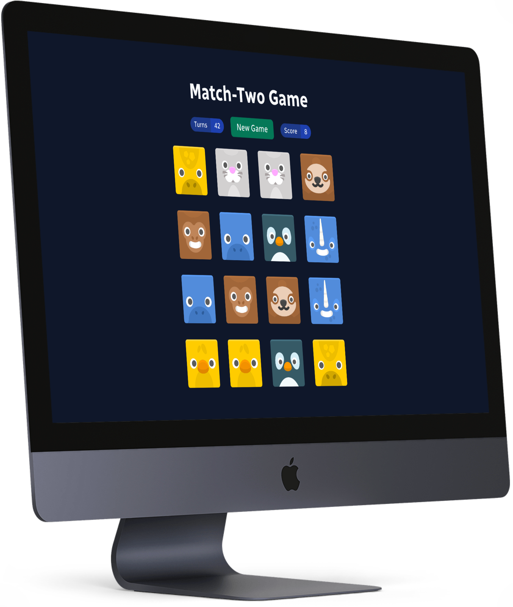
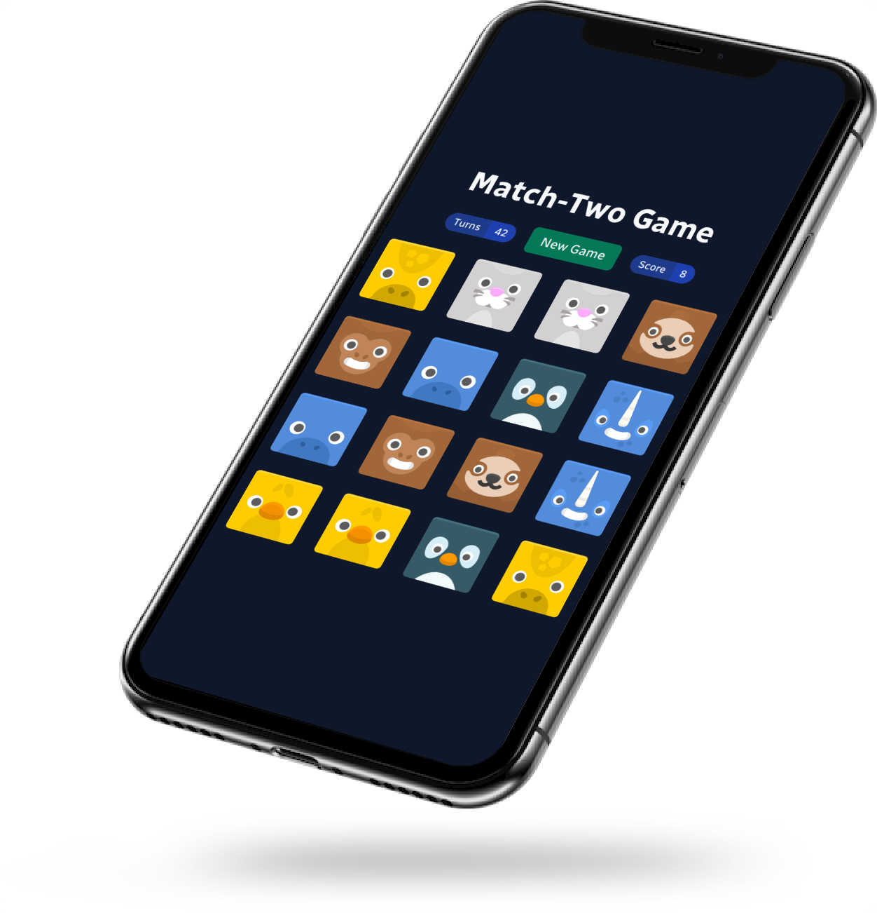

# Match-Two Game

A simple match-two game built using React, with a focus on beautiful animations,
clean code, and simple yet effective design.

## Play the game

  
   
  Works on both desktops and mobile devices.

## Screenshots

  
   
  Tile animations using CSS.

  
   
  Desktop screenshot.

  
   
  Mobile screenshot.

## License

Released under the MIT license.
